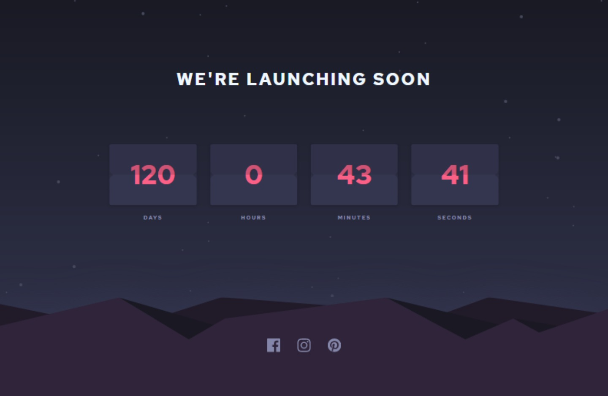

# Frontend Mentor - Launch countdown timer solution

This is a solution to the [Launch countdown timer challenge on Frontend Mentor](https://www.frontendmentor.io/challenges/launch-countdown-timer-N0XkGfyz-). Frontend Mentor challenges help you improve your coding skills by building realistic projects.

## Table of contents

- [Overview](#overview)
  - [The challenge](#the-challenge)
  - [Screenshot](#screenshot)
  - [Links](#links)
- [My process](#my-process)
  - [Built with](#built-with)
  - [What I learned](#what-i-learned)
  - [Continued development](#continued-development)
  - [Useful resources](#useful-resources)
- [Author](#author)

## Overview

### The challenge

Users should be able to:

- See hover states for all interactive elements on the page
- See a live countdown timer that ticks down every second (start the count at 14 days)
- **Bonus**: When a number changes, make the card flip from the middle

### Screenshot

### Links

- Solution URL: [Click Here](https://your-solution-url.com)
- Live Site URL: [Click Here](https://chysomm62.github.io/launch_countdown-timer/)

## My process

### Built with

- Semantic HTML5 markup
- CSS custom properties
- Flexbox
- Mobile-first workflow
- [React](https://reactjs.org/) - JS library

### What I learned

Basically little about REACT. This is the first REACT project I'm trying out on my own. The layout is kinda easy but it took alot of time to figure somethings out.

- learnt about hosting a REACT app using gh-pages, not sure I've fully learnt sha
- practiced the use of some REACT hooks
- folder structure and many more

### Continued development

I want to improve my REACT and JavaScript knowledge, so I might be working on other projects with them.

### Useful resources

- [Google](https://www.google.com) - This is basically what got me to this stage of the project.
- [StackOverflow](https://www.stackoverflow.com) - Almost all questions a developer has, might have been answered by someone else.

## Author

- Github - [@chysomm62](https://www.github.com/chysomm62)
- Frontend Mentor - [@Chysomm62](https://www.frontendmentor.io/profile/chysomm62)
- Twitter - [@chisom](https://www.twitter.com/chipreda)
